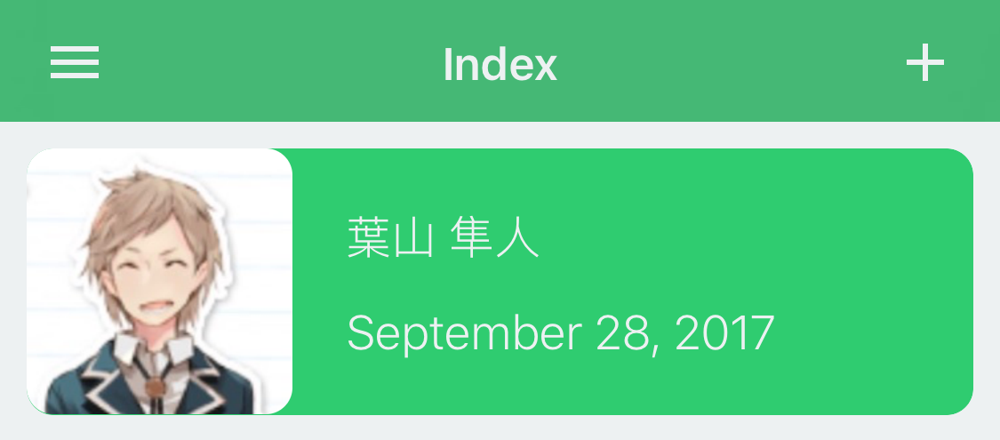
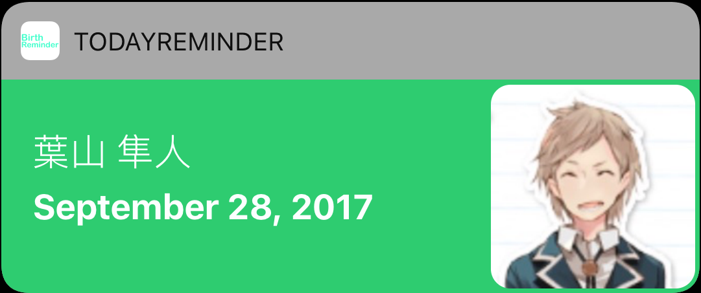
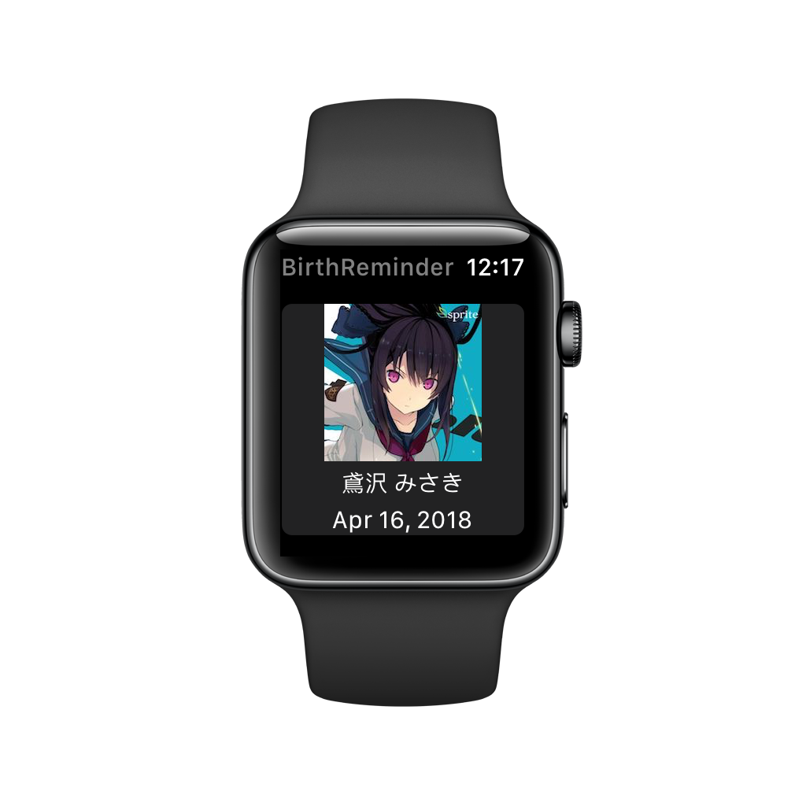
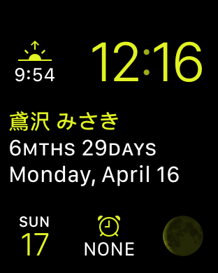
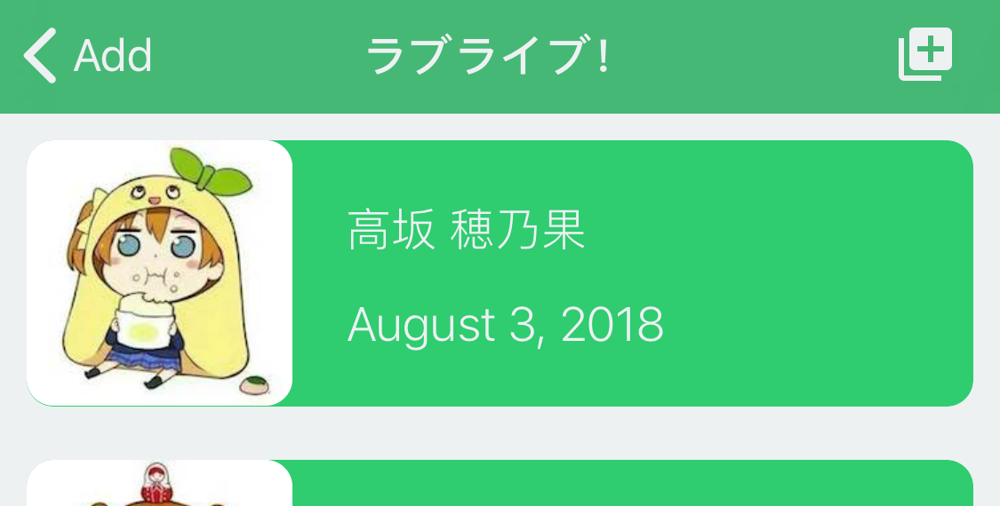

# Birthday Reminder
> A tool that helps you manage your favorite anime characters' births

# Features
## Supports both iOS and watchOS
This app supports iOS, TodayExtension(iOS), watchOS and Complications(watchOS)

This means you may check the birth info by just raising your wrist, or swiping down from your phone's top

## Online birth info
Of course, you may add the birth info manually, but it's usually time-consuming

Here, you may import characters easily

The only thing you need is tapping on the ADD button

# Contribution
## Online Info
If you would like to add more birth info, please email me:
CaptainYukinoshitaHachiman@ProtonMail.com

(Only ACGN characters are allowed)

## APP bug fixing/feature adding
If you have nice ideas, or find a bug with the app, please open an issue or a PR
