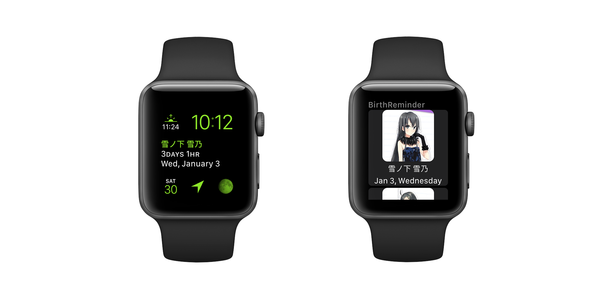

# Birthday Reminder

> The tool that helps you manage your favorite anime characters' births


[](http://forthebadge.com)
[](https://swift.org/)
[](http://forthebadge.com)

[](https://github.com/CaptainYukinoshitaHachiman/BirthReminder)
[](https://github.com/CaptainYukinoshitaHachiman/BirthReminder)
[](https://github.com/CaptainYukinoshitaHachiman/BirthReminder)
[](https://github.com/CaptainYukinoshitaHachiman/BirthReminder)

[](https://itunes.apple.com/us/app/birth-reminder/id1286497475?ls=1&mt=8)
[](https://www.travis-ci.org/CaptainYukinoshitaHachiman/BirthReminder)
[](https://github.com/CaptainYukinoshitaHachiman/BirthReminder/blob/master/LICENSE)
[](https://join.slack.com/t/birthreminder/shared_invite/enQtMjgwOTExNDA1MzE2LTkyZDQ3MWVmMmM0OWFhNzIyYzFkMGMwY2ZjMjY0ZGU1M2E2MTNjODlhNWQ1OTEzZmVlMWY4OTc5Njk0Njc1MTc)
# Features

## Supports both iOS and watchOS

This app supports iOS, iOS Today Extension, watchOS, and watchOS Complications

Wanna check the birth info? Just raise your wrist or swipe down from the top of your phone!




## Online Birth Info

Of course, you may add the birth info manually, but it's usually time-consuming

Here, you may import characters easily

The only thing you need is to tap the ADD button


# Download

Coming soon on the App Store

[](https://itunes.apple.com/us/app/birth-reminder/id1286497475?ls=1&mt=8)

Also, you may [join in beta testing](https://birth-reminder-testflight.herokuapp.com) in order to try the latest features.

# Contribution

## Online Info

If you would like to add more birth info, please [email the info](mailto:CaptainYukinoshitaHachiman@tcwq.tech) in this format
```JSON
{
	"anime":{
    	"name":"",
        "picUrl":"", // a url to the anime's pic (JPEG format, 200px*200px)
        "picCopyright":"" // a description of the copyright info of the pic, e.g. "pixiv, pidXXX", "Offical LOGO, http://xxx.png"
	},
    "characters":[ // an array which includes all the characters in the anime
    	{
        	"name":"",
            "birth":"", // the birth of the character, "MM-dd" formatted. e.g. "09-06" for Sept.6
            "picUrl":"", // a url to the anime's pic (JPEG format, 200px*200px)
        	"picCopyright":"" // a description of the copyright info of the pic, e.g. "pixiv, pidXXX", "CHARACTERS | 「妹さえいればいい。」\nhttp://.../chara_itsuki.png"
        }
    ]
}
```

(Only ACGN characters are welcome)

## APP Bug Report/Feature Suggestion

If you have nice ideas or find a bug in the app, please open an issue or a PR

<meta name="apple-itunes-app" content="app-id=1286497475">