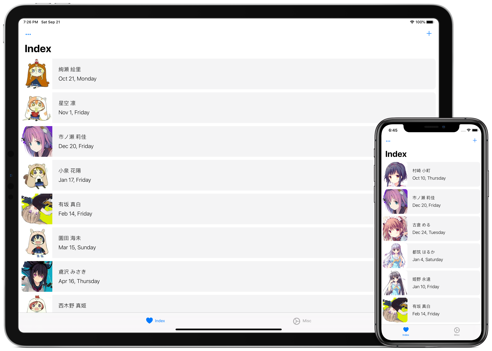
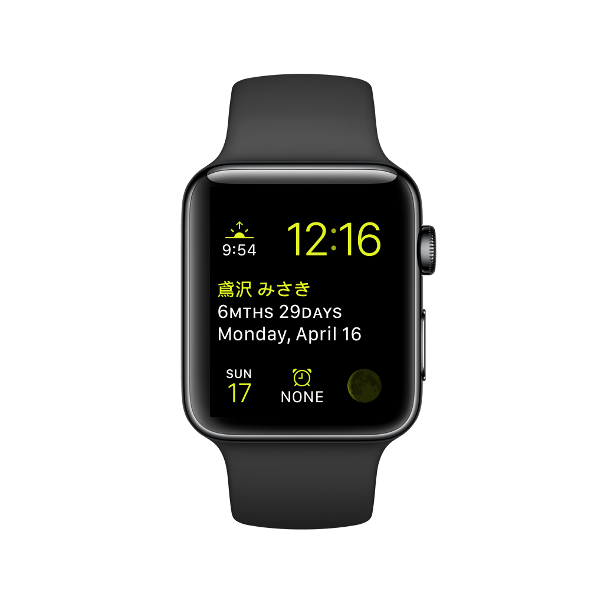
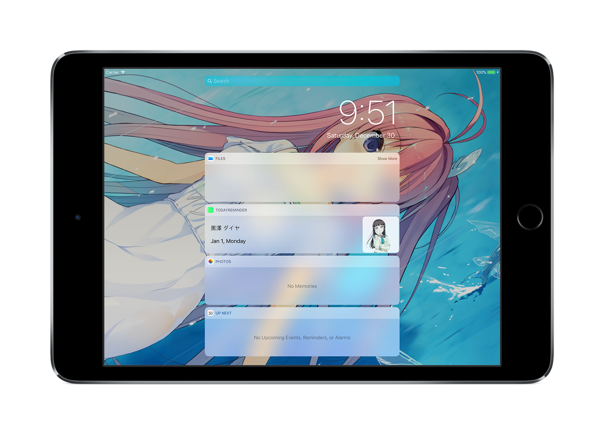

# Birthday Reminder

> A tool that helps you manage your favorite anime characters' births

# Features

## Supports both iOS and watchOS

This app supports iOS, iOS Today Extension, watchOS, and watchOS Complications

Wanna check the birth info? Just raise your wrist or swipe down from the top of your phone!

## Online Birth Info

Of course, you may add the birth info manually, but it's usually time-consuming

Here, you may import characters easily

The only thing you need is tapping the ADD button

# Download

Available on the App Store soon!

If you'd like to receive the latest version through TestFlight, [email me](mailto:CaptainYukinoshitaHachiman@ProtonMail.com) your iCloud account, then I'll send you an invitation

# Contribution

## Online Info

If you would like to add more birth info, please email me:
[CaptainYukinoshitaHachiman@ProtonMail.com](mailto:CaptainYukinoshitaHachiman@ProtonMail.com)

(Only ACGN characters are welcome)

## APP Bug Report/Feature Suggestion

If you have nice ideas or find a bug in the app, please open an issue or a PR
